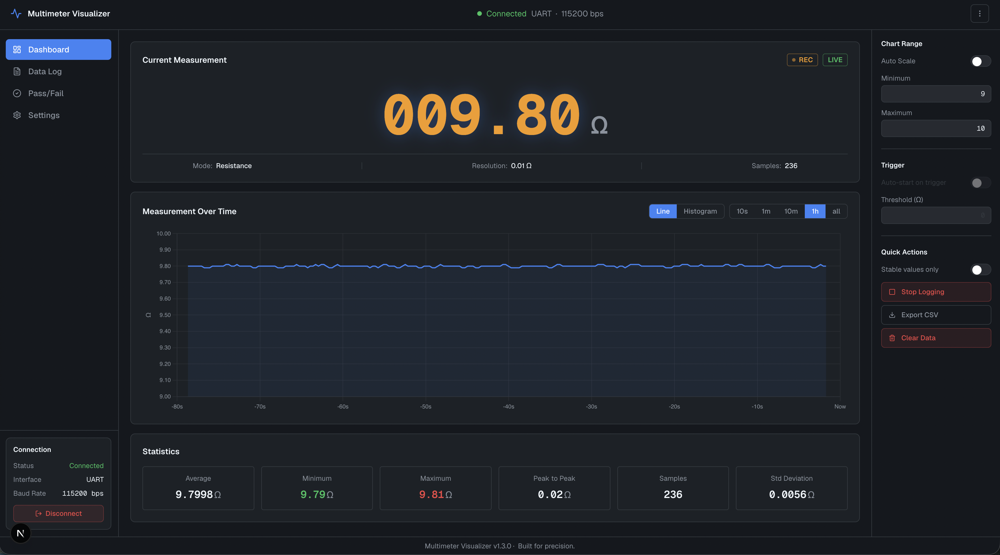

# Multimeter·Live

Real-time dashboard for the **ZOYI ZT703s** multimeter, running entirely in the
browser. Connect the meter over the Web Serial API and you get a large digital
readout, a rolling trend chart, session logging with running statistics, CSV export,
and a Pass/Fail view for sorting components against a reference. There is no backend
and nothing to install.




## Live demo

**<https://fyfar.github.io/multimeter-live/>**

Open it in a supported browser (Chrome, Edge, Opera, or Firefox 151+), connect your
meter, and click **Connect**. Everything runs locally in your browser and no data
leaves your machine.

After the first time, you mostly stop clicking Connect. The app remembers the adapter
you used and picks it back up when you reload or reopen the tab, without the browser's
port chooser. Pressing Disconnect forgets it again, so if you free the port for
something else, a reload will not quietly take it back.

### Install and offline use

Multimeter·Live is a Progressive Web App, so there is no `.exe`, no `.dmg`, and no app
store listing. The web app is the app. In a supporting browser you can install it from
the address-bar install icon and launch it in its own window with its own icon, the way
you would a native desktop program.

After your first visit it works fully offline, which is useful on a bench or in the
field with no Wi-Fi. The meter connects over USB, so nothing in the app needs the
network anyway. The same install runs on Windows, macOS, Linux, and ChromeOS, and the
browser handles the packaging, so there are no separate binaries to maintain or trust.

When a new version is published the app does not reload on its own, because that would
interrupt a recording. It shows a small "A new version is available" notice with Reload
and Later buttons, so you update when it suits you. If a session has rows in it, the
browser will also ask before the page goes away. You never reinstall to update.

> **Not an official ZOYI / ZOTEK product.** Multimeter·Live is an independent,
> community-built project and is **not affiliated with, endorsed by, or supported
> by ZOYI or ZOTEK**. "ZOYI", "ZOTEK", and "ZT703s" are referenced only to describe
> the hardware this tool works with.

> **Device support:** Built specifically for the **ZOYI ZT703s** and its serial
> packet format. The **ZT703s+** and **ZT706** likely use the same protocol and may
> work, but they are **untested**. Other multimeters are not supported.

## Features

- **Live digital readout** of the current measurement, mode, unit, and resolution
- **Rolling trend chart** with selectable time windows: 10 s, 1 m, 10 m, 1 h, or
  **all**, which plots the entire session
- **Session logging** with running statistics: average, min, max, peak-to-peak,
  sample count, and standard deviation
- **Pass/Fail component testing** against a reference and tolerance, with a verdict
  per part and its own CSV export. See below.
- **Trigger auto-logging**. Arm a threshold and recording starts by itself when the
  measured magnitude crosses it, then stops once it falls back below. The release
  point sits under the arm point, so a signal hovering at the edge does not flap
  logging on and off.
- **Auto-reconnect** to the last adapter you used, on reload and on reopening the tab.
  The port is chosen by which one actually sends readings, not by position in the list,
  because a USB-serial adapter can appear more than once and the entries are not
  otherwise distinguishable.
- **Auto-scale or manual Y-axis range**, with out-of-range samples flagged on the chart
- **CSV export** of the recorded session (timestamp, mode, value, unit)
- **Settings** for stability sampling, trigger hysteresis, what survives a mode change,
  the capacitance no-part floor, and the audible alerts
- **Configurable baud rate** (9600 to 115200)

Measurements themselves are not restored across a reload. The connection and your view
come back, but the table starts empty, which is deliberate rather than an oversight.

## Pass/Fail component testing

Type in a reference value and a tolerance, then touch parts one after another. Each
part that settles gets a PASS or FAIL against the band, lands in a table, and can
optionally beep. The pass and fail tones are far apart in pitch and length so you can
tell them apart without looking at the screen, which is the point when you are sorting
a tray of resistors. Verdicts export to their own CSV, separate from the data log.

Some honest limits. It covers resistance, diode, and capacitance only: voltage and
current have no overload reading on lifted probes, so there is no reliable way to tell
where one part ends and the next begins. A part that reads as a dead short is reported
as "no part connected" rather than as a failure, so Pass/Fail finds out-of-tolerance
parts rather than shorts. Meter accuracy is not modelled, though the app warns you if
your tolerance band is narrower than the meter can resolve.

## Requirements

- A **ZOYI ZT703s** multimeter connected over USB serial (see the device note above).
- A browser with the Web Serial API: any Chromium-based browser (Chrome, Edge, Opera)
  or **Firefox 151+** on desktop ([added May 2026](https://hacks.mozilla.org/2026/05/web-serial-support-in-firefox/)).
  Safari is not supported. On Firefox Enterprise builds, Web Serial is off by default
  and has to be enabled with the `DefaultSerialGuardSetting` policy.
- An origin served over `https://` or `localhost`, because Web Serial requires a secure
  context. The live demo is served over HTTPS, so it works as-is.

## Run it locally

```sh
npm install
npm run dev
```

Open [http://localhost:3000](http://localhost:3000), click **Connect**, and pick your
serial port from the browser prompt.

## Contributing

Issues and pull requests are welcome. If you have a ZT703s+ or ZT706 and can confirm
whether it works, or you would like to add a feature or fix a bug, please open an
[issue](https://github.com/Fyfar/multimeter-live/issues) or send a PR.

## License

[MIT](./LICENSE)
